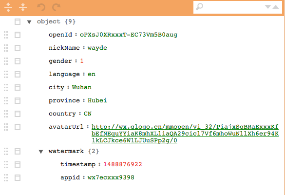

# wechat-little-program-aes128
微信小程序Ruby版本加密信息解密实例

### 用法实例

index.rb 为样例代码，使用前请将相关参数修改为您个人小程序相关信息

`pc = WXBizDataCrypt.new(app_id, session_key)`

`puts pc.decrypt(encrypted_data, iv)`

```
$ ruby index.rb
```

### 解析JSON结果

```
$ ruby index.rb

{"openId"=>"oPXsJ0XRxxxT-EC73Vm5B0aug", "nickName"=>"wayde", "gender"=>1, "language"=>"en", "city"=>"Wuhan", "province"=>"Hubei", "country"=>"CN", "avatarUrl"=>"http://wx.qlogo.cn/mmopen/vi_32/PiajxSqBRaExxxKfbEfNEquYYiaK8mhXLliaQA29cicl7Vf6mhoWuNllXh6er94K1kLCJkce6W1LJUuSPp2g/0", "watermark"=>{"timestamp"=>1488876922, "appid"=>"wx7ecxxx9398"}}
```

[JSON 在线编缉器](http://www.jsoneditoronline.cn/)
http://www.jsoneditoronline.cn/



[有其它问题欢迎交流](mailto:wayde.sun@gmail.com?Subject=WxChat little program%20Text&Body=Thank%20you)
